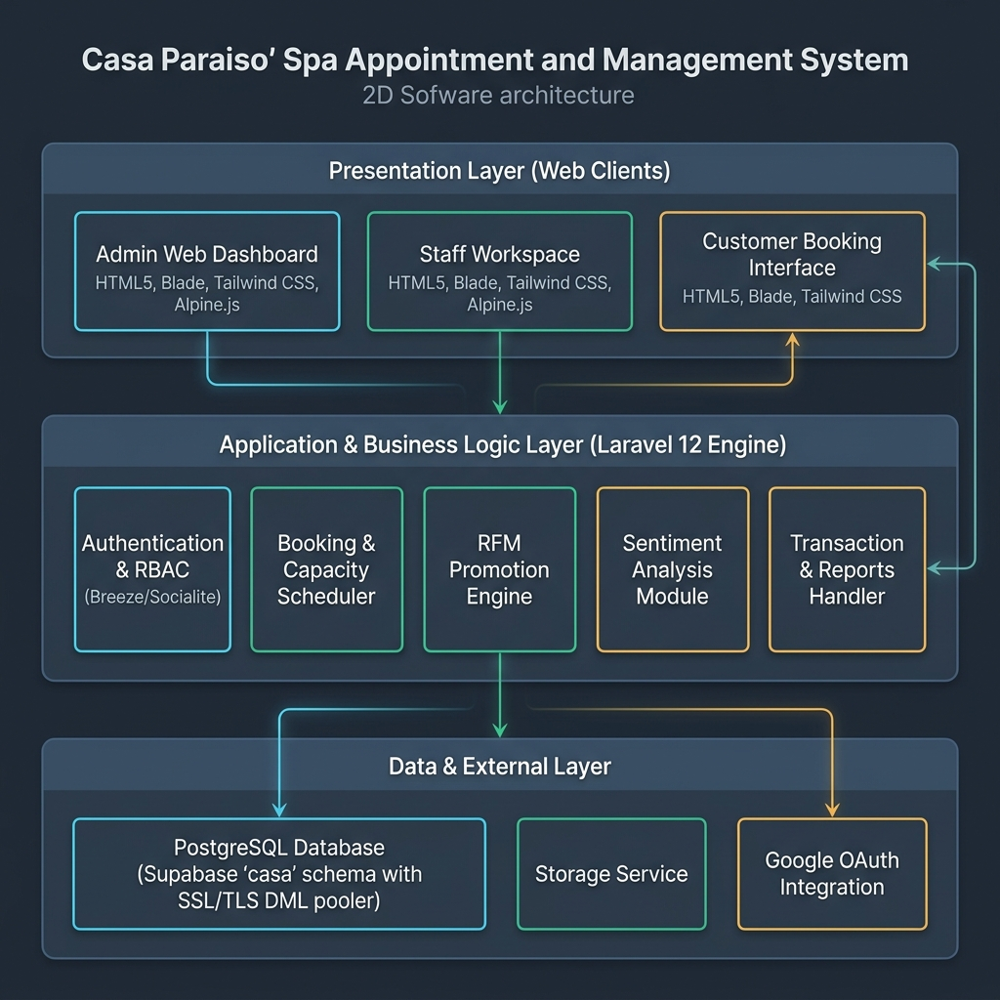
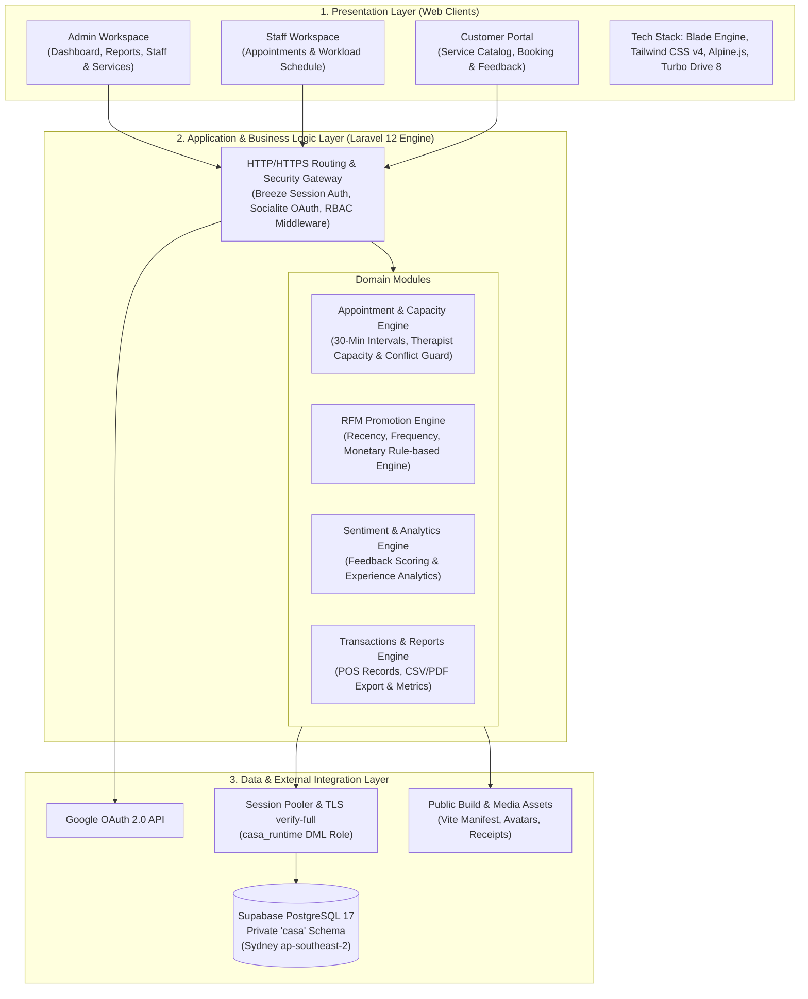

# 6. Technology: Implemented Web Software Architecture

## Purpose
This document presents the implemented web software architecture for **Casa Paraiso - Body and Wellness Spa System**. The system is engineered as a robust 3-tier web application using Laravel 12, tailored to deliver real-time booking management, RFM-driven personalized promotions, sentiment analytics, and administrative oversight.

---

## 6.1 System Architecture Schematic Diagram

*Figure 6.1: High-Level Schematic Diagram of the Casa Paraiso Web System Architecture.*

---

## 6.2 Architectural Blueprint & Layer Breakdown

The web architecture follows a classic **3-Tiered Monolithic Service Pattern**, ensuring high security, low operational maintenance, fast page load times, and clear domain separation without requiring complex microservices.

---

## 6.3 Detailed Layer Descriptions

### 1. Presentation Layer (Frontend & UI)
- **Blade Templating Engine**: Provides fast, server-rendered HTML views optimized for SEO and low-latency interaction.
- **Tailwind CSS v4**: Utility-first CSS framework configured through Vite for custom, commercial-grade styling and dark/light visual harmony.
- **Alpine.js & Turbo Drive 8**: Light footprint JavaScript libraries managing local interactive state (calendar date pickers, collapsible filters, confirmation modals) and smooth same-origin GET navigation.
- **Compact Workspace UX Pattern**: Standardized across administrative tables, featuring `list-toolbar` for responsive filter counts, `table-shell` for accessible keyboard navigation, and server-controlled 15-item pagination (`pagination.compact`).

### 2. Application & Business Logic Layer (Laravel 12 Engine)
- **Security & Authentication**:
  - **Laravel Breeze**: Handles secure session-based email/password authentication and email verification.
  - **Laravel Socialite**: Integrated Google OAuth 2.0 authentication for seamless customer login.
  - **Role-Based Access Control (RBAC)**: Strict middleware guards separating Admin, Staff, and Customer access permissions.
- **Core Business Logic Engines**:
  - **Appointment & Booking Scheduler**: Enforces the 1:00 PM – 12:00 MN business hours operating window (Asia/Manila timezone) with 30-minute start intervals. Transactionally verifies therapist capacity and prevents double-booking.
  - **RFM Rule-Based Promotion Engine**: Computes Recency, Frequency, and Monetary scores per customer to automatically trigger personalized promotional codes and discount tiers.
  - **Sentiment & Feedback Analytics**: Evaluates customer reviews using rule-based sentiment scoring to provide actionable spa management insights.
  - **Transactions & Reporting**: Records daily turnover, manages service receipts, and generates CSV/PDF exportable reporting artifacts.

### 3. Data & Integration Layer (Persistence & APIs)
- **Supabase PostgreSQL 17**:
  - Located in the Sydney (`ap-southeast-2`) region.
  - Application data isolated inside the private `casa` schema.
  - Strict security separation: schema migrations managed by `casa_migrator`, while runtime DML queries operate under `casa_runtime` via a session connection pooler with `verify-full` TLS encryption.
- **Google OAuth 2.0 Integration**: Handles external identity verification.
- **Local / Sail Docker Environment**: Powered by Docker Desktop Sail services (`scripts/casa-docker.ps1`) for local development, testing, and demonstration quick-tunneling via Cloudflare.

---

## 6.4 Key Technical Constraints & Quality Standards (ISO/IEC 25010)

1. **Usability**: Mobile-first responsive web design with accessible, high-contrast UI controls complying with `BRAND_UI_GUIDE.md`.
2. **Security**: Password hashing (Bcrypt/Argon2), CSRF protection, SQL injection prevention via Eloquent ORM parameterized queries, and least-privilege database roles.
3. **Maintainability**: Single monolithic code repository with no complex background AI workers, ensuring low-maintenance operations for non-technical spa management.
